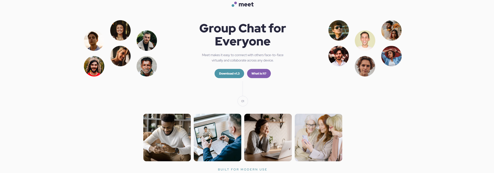

# Meet Landing Page

A responsive landing page built as a Frontend Mentor challenge using semantic HTML and modern CSS.

## Final Project Output

## Project Overview

This project recreates the Meet landing page design with a mobile-first workflow.
The goal was to practice clean structure, responsive layouts, and consistent styling using a small design system.

## What I Built

- Semantic HTML page structure with accessible content hierarchy
- Responsive hero section with breakpoint-specific image behavior
- Features gallery using CSS Grid
- Reusable decorative number markers (01 and 02)
- CTA section with background image, overlay, and action button
- Hover and focus states for interactive elements

## Built With

- HTML5
- CSS3
- Mobile-first responsive design
- CSS custom properties (design tokens)
- Flexbox and CSS Grid

## Responsive Behavior

- Mobile: default styles and stacked layout
- Tablet (768px+): layout and spacing adjustments, asset swaps
- Desktop (1200px+): larger typography, desktop hero composition, and tuned spacing

## What I Practiced

- Structuring pages with semantic elements
- Creating and reusing a CSS token system
- Balancing spacing and alignment across breakpoints
- Building stable decorative UI elements across screen sizes
- Debugging responsive positioning issues in real layouts

## Challenges and Lessons Learned

- Responsive spacing can look correct at one breakpoint and feel off at another, so I tested frequently while building.
- Decorative UI elements (like numbered markers with connector lines) need careful margin and layering rules to stay stable.
- Using design tokens for spacing and colors made later adjustments faster and more consistent.
- Building mobile-first helped me focus on structure first, then scale the layout cleanly for tablet and desktop.

## Folder Structure

- starter-code/index.html
- starter-code/style.css
- starter-code/assets/

## Author

Frontend Mentor learner project by Roli.
